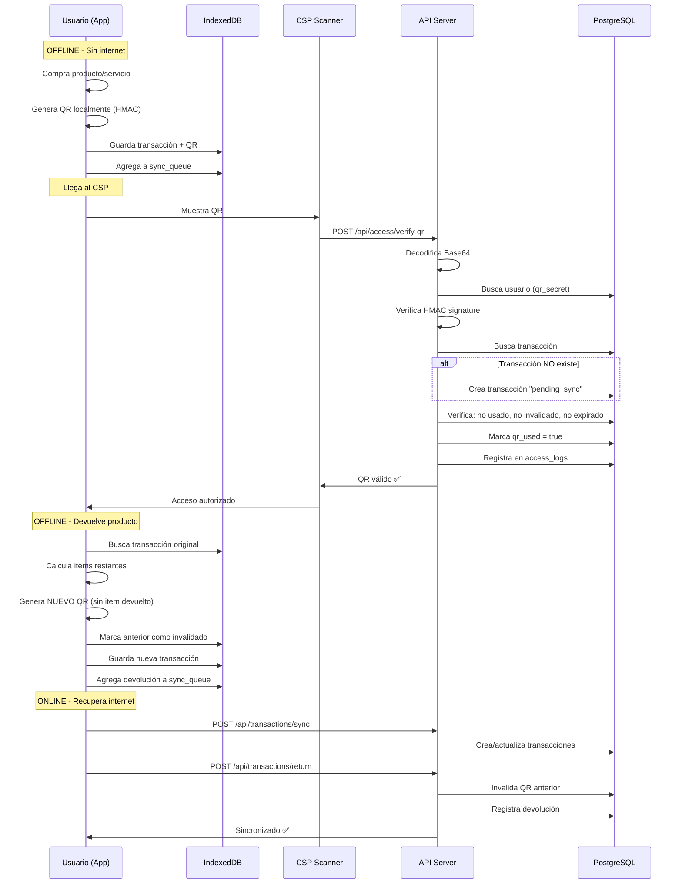

# 🎫 Sistema de QR Offline-First - Arquitectura Completa

**Fecha:** 17 de octubre de 2025  
**Versión:** v1.0  
**Estado:** Diseño arquitectónico

---

## 🎯 Objetivo

Implementar un sistema de códigos QR dinámicos que funcione **completamente offline** durante la compra, pero que se valide **online** en los puntos de servicio (CSP/CSS/CSH).

---

## 📋 Requisitos del Negocio

### Flujo Real de Usuario:

1. **Compra offline** → Usuario adquiere productos/servicios en vending machine SIN internet
2. **Genera QR offline** → App móvil genera QR localmente sin necesidad de servidor
3. **Llega al CSP** → Usuario muestra QR en punto de servicio CON internet
4. **Validación online** → CSP escanea y valida QR contra el servidor
5. **Devolución offline** → Usuario devuelve producto, invalida QR anterior, genera nuevo QR
6. **Sincronización diferida** → Cuando recupera internet, sincroniza transacciones

### Casos de Uso Críticos:

- ✅ **Compra múltiple:** 1 servicio + 2 productos vending → 1 QR único
- ✅ **Devolución parcial:** Devuelve 1 producto → Invalida QR anterior → Genera nuevo QR
- ✅ **Sin internet permanente:** Usuario puede usar todo offline hasta llegar al CSP
- ✅ **Seguridad:** QR no puede ser falsificado (HMAC signature)
- ✅ **Expiración:** QR válido por tiempo limitado (ej: 24 horas)

---

## 🏗️ Arquitectura del Sistema

### Componente 1: Generación Offline (App Móvil)

**Responsabilidad:** Generar QR localmente sin conexión al servidor.

```typescript
// src/lib/qr-generator.ts

import { Buffer } from "buffer";
import crypto from "crypto-js";
import QRCode from "qrcode";

interface QRPayload {
  transaction_id: string; // UUID generado offline
  user_id: string; // ID del usuario
  items: TransactionItem[]; // Productos/servicios adquiridos
  timestamp: number; // Fecha de compra (Unix timestamp)
  signature: string; // HMAC para verificar autenticidad
  version: string; // Versión del QR (para retrocompatibilidad)
}

interface TransactionItem {
  type: "product" | "service";
  id: string;
  name: string;
  quantity: number;
  price: number;
}

interface Transaction {
  id: string;
  user_id: string;
  items: TransactionItem[];
  total: number;
  created_at: Date;
  parent_transaction_id?: string; // Si es modificación de otra transacción
}

/**
 * Genera un código QR offline basado en una transacción
 * @param transaction - Transacción de compra
 * @param userSecret - Secret único del usuario (obtenido en login)
 * @returns Imagen QR en formato Base64
 */
export async function generateOfflineQR(transaction: Transaction, userSecret: string): Promise<string> {
  // 1. Preparar payload
  const payload: QRPayload = {
    transaction_id: transaction.id,
    user_id: transaction.user_id,
    items: transaction.items,
    timestamp: Date.now(),
    signature: "", // Se generará después
    version: "1.0",
  };

  // 2. Generar firma HMAC (garantiza que no sea falsificado)
  const dataToSign = JSON.stringify({
    transaction_id: payload.transaction_id,
    user_id: payload.user_id,
    items: payload.items,
    timestamp: payload.timestamp,
  });

  payload.signature = crypto.HmacSHA256(dataToSign, userSecret).toString();

  // 3. Codificar payload en Base64
  const jsonPayload = JSON.stringify(payload);
  const base64Payload = Buffer.from(jsonPayload).toString("base64");

  // 4. Generar imagen QR
  const qrImage = await QRCode.toDataURL(base64Payload, {
    errorCorrectionLevel: "H", // Alta corrección de errores
    width: 300,
    margin: 2,
  });

  // 5. Guardar en IndexedDB local
  await saveQRToStorage(transaction.id, qrImage, payload);

  return qrImage;
}

/**
 * Guarda el QR y la transacción en IndexedDB
 */
async function saveQRToStorage(transactionId: string, qrImage: string, payload: QRPayload): Promise<void> {
  const db = await openIndexedDB();

  await db.transactions.put({
    id: transactionId,
    qr_image: qrImage,
    qr_payload: payload,
    status: "pending_sync",
    created_at: new Date(),
    synced: false,
  });
}

/**
 * Genera un UUID único offline
 */
export function generateOfflineUUID(): string {
  return "xxxxxxxx-xxxx-4xxx-yxxx-xxxxxxxxxxxx".replace(/[xy]/g, (c) => {
    const r = (Math.random() * 16) | 0;
    const v = c === "x" ? r : (r & 0x3) | 0x8;
    return v.toString(16);
  });
}
```

---

### Componente 2: Validación Online (API Backend)

**Responsabilidad:** Verificar QR escaneado en CSP con internet.

```typescript
// src/api/controllers/qr-validation.controller.ts

import { NextApiRequest, NextApiResponse } from "next";
import crypto from "crypto";
import { asyncHandler } from "@/api/middlewares/async-handler";
import { AppError } from "@/api/errors/AppError";
import { ErrorMessages } from "@/shared/constants/error-messages";
import { supabase } from "@/api/lib/supabase";
import { logger } from "@/api/lib/logger";

interface QRPayload {
  transaction_id: string;
  user_id: string;
  items: Array<{
    type: "product" | "service";
    id: string;
    name: string;
    quantity: number;
    price: number;
  }>;
  timestamp: number;
  signature: string;
  version: string;
}

interface VerifyQRRequest {
  qr_data: string; // Payload Base64 del QR
  location_id: string; // ID del CSP/CSS/CSH donde se escanea
  scanned_by?: string; // ID del empleado que escanea (opcional)
}

/**
 * POST /api/access/verify-qr
 * Valida un código QR escaneado en un punto de servicio
 */
export const verifyQR = asyncHandler(async (req: NextApiRequest, res: NextApiResponse) => {
  const { qr_data, location_id, scanned_by } = req.body as VerifyQRRequest;

  // 1. Validar inputs
  if (!qr_data || !location_id) {
    throw new AppError("qr_data y location_id son requeridos", 400);
  }

  // 2. Decodificar payload del QR
  let payload: QRPayload;
  try {
    const jsonPayload = Buffer.from(qr_data, "base64").toString("utf-8");
    payload = JSON.parse(jsonPayload);
  } catch (error) {
    logger.error("Error al decodificar QR", { error, qr_data });
    throw new AppError("QR inválido o corrupto", 400);
  }

  // 3. Verificar versión del QR
  if (payload.version !== "1.0") {
    throw new AppError(`Versión de QR no soportada: ${payload.version}`, 400);
  }

  // 4. Obtener secret del usuario para verificar firma
  const { data: user, error: userError } = await supabase.from("usuarios").select("qr_secret").eq("id", payload.user_id).single();

  if (userError || !user) {
    throw new AppError(ErrorMessages.USER_NOT_FOUND, 404);
  }

  // 5. Verificar firma HMAC (anti-falsificación)
  const dataToVerify = JSON.stringify({
    transaction_id: payload.transaction_id,
    user_id: payload.user_id,
    items: payload.items,
    timestamp: payload.timestamp,
  });

  const expectedSignature = crypto.createHmac("sha256", user.qr_secret).update(dataToVerify).digest("hex");

  if (payload.signature !== expectedSignature) {
    logger.warn("QR con firma inválida detectado", {
      user_id: payload.user_id,
      transaction_id: payload.transaction_id,
    });
    throw new AppError("QR falsificado o manipulado", 403);
  }

  // 6. Verificar expiración (24 horas por defecto)
  const QR_EXPIRATION_MS = 24 * 60 * 60 * 1000; // 24 horas
  const now = Date.now();
  if (now - payload.timestamp > QR_EXPIRATION_MS) {
    throw new AppError("QR expirado", 410);
  }

  // 7. Buscar transacción en BD (puede no existir si aún no sincronizó)
  let { data: transaction } = await supabase.from("transactions").select("*").eq("id", payload.transaction_id).single();

  // 8. Si no existe, crear transacción "pending_sync"
  if (!transaction) {
    logger.info("Transacción no encontrada, creando desde QR", {
      transaction_id: payload.transaction_id,
    });

    const { data: newTransaction, error: createError } = await supabase
      .from("transactions")
      .insert({
        id: payload.transaction_id,
        user_id: payload.user_id,
        items: payload.items,
        total: payload.items.reduce((sum, item) => sum + item.price * item.quantity, 0),
        status: "pending_sync",
        created_at: new Date(payload.timestamp).toISOString(),
        qr_used: false,
      })
      .select()
      .single();

    if (createError) {
      logger.error("Error al crear transacción desde QR", { error: createError });
      throw new AppError("Error al procesar QR", 500);
    }

    transaction = newTransaction;
  }

  // 9. Verificar si QR ya fue usado
  if (transaction.qr_used) {
    throw new AppError("QR ya utilizado anteriormente", 409);
  }

  // 10. Verificar si QR fue invalidado (por devolución)
  if (transaction.qr_invalidated) {
    throw new AppError(`QR invalidado: ${transaction.qr_invalidated_reason || "devolución"}`, 410);
  }

  // 11. Marcar QR como usado
  await supabase
    .from("transactions")
    .update({
      qr_used: true,
      qr_used_at: new Date().toISOString(),
      qr_used_location: location_id,
      qr_used_by: scanned_by,
    })
    .eq("id", payload.transaction_id);

  // 12. Registrar log de acceso (auditoría)
  await supabase.from("access_logs").insert({
    transaction_id: payload.transaction_id,
    user_id: payload.user_id,
    location_id,
    qr_data: qr_data.substring(0, 100), // Solo primeros 100 chars
    validation_result: "valid",
    scanned_by,
    timestamp: new Date().toISOString(),
  });

  logger.info("QR validado exitosamente", {
    transaction_id: payload.transaction_id,
    user_id: payload.user_id,
    location_id,
  });

  // 13. Retornar resultado
  return res.status(200).json({
    valid: true,
    transaction: {
      id: transaction.id,
      items: transaction.items,
      total: transaction.total,
      user_id: transaction.user_id,
    },
    message: "QR válido - Acceso autorizado",
  });
});
```

---

### Componente 3: Devoluciones Offline

**Responsabilidad:** Manejar devoluciones de productos sin conexión.

```typescript
// src/lib/qr-returns.ts

interface ReturnRequest {
  original_transaction_id: string;
  returned_items: Array<{
    item_id: string;
    quantity: number;
  }>;
  reason?: string;
}

/**
 * Procesa una devolución offline
 * - Invalida QR anterior
 * - Genera nuevo QR con items actualizados
 */
export async function handleOfflineReturn(returnRequest: ReturnRequest, userSecret: string): Promise<string> {
  // 1. Obtener transacción original desde IndexedDB
  const db = await openIndexedDB();
  const originalTx = await db.transactions.get(returnRequest.original_transaction_id);

  if (!originalTx) {
    throw new Error("Transacción original no encontrada");
  }

  // 2. Calcular items restantes (después de devolución)
  const remainingItems = originalTx.qr_payload.items
    .map((item) => {
      const returnedItem = returnRequest.returned_items.find((ri) => ri.item_id === item.id);

      if (returnedItem) {
        return {
          ...item,
          quantity: item.quantity - returnedItem.quantity,
        };
      }

      return item;
    })
    .filter((item) => item.quantity > 0); // Eliminar items con cantidad 0

  // 3. Crear nueva transacción
  const newTransaction: Transaction = {
    id: generateOfflineUUID(),
    user_id: originalTx.qr_payload.user_id,
    items: remainingItems,
    total: remainingItems.reduce((sum, item) => sum + item.price * item.quantity, 0),
    created_at: new Date(),
    parent_transaction_id: returnRequest.original_transaction_id,
  };

  // 4. Generar nuevo QR
  const newQR = await generateOfflineQR(newTransaction, userSecret);

  // 5. Marcar transacción anterior como invalidada localmente
  await db.transactions.update(returnRequest.original_transaction_id, {
    qr_invalidated_locally: true,
    qr_invalidated_reason: "return",
    qr_invalidated_at: new Date(),
  });

  // 6. Agregar a cola de sincronización
  await db.sync_queue.add({
    type: "return",
    original_transaction_id: returnRequest.original_transaction_id,
    new_transaction_id: newTransaction.id,
    returned_items: returnRequest.returned_items,
    reason: returnRequest.reason,
    timestamp: Date.now(),
  });

  logger.info("Devolución procesada offline", {
    original_tx: returnRequest.original_transaction_id,
    new_tx: newTransaction.id,
  });

  return newQR;
}
```

---

### Componente 4: Sincronización

**Responsabilidad:** Sincronizar transacciones offline cuando hay internet.

```typescript
// src/lib/qr-sync.ts

interface SyncQueueItem {
  type: "purchase" | "return";
  transaction_id: string;
  data: any;
  timestamp: number;
}

/**
 * Sincroniza todas las transacciones pendientes con el servidor
 */
export async function syncPendingTransactions(): Promise<{
  synced: number;
  errors: string[];
}> {
  const db = await openIndexedDB();
  const queue = await db.sync_queue.toArray();

  let synced = 0;
  const errors: string[] = [];

  for (const item of queue) {
    try {
      if (item.type === "purchase") {
        await syncPurchase(item);
      } else if (item.type === "return") {
        await syncReturn(item);
      }

      // Eliminar de cola si fue exitoso
      await db.sync_queue.delete(item.id);
      synced++;
    } catch (error) {
      logger.error("Error al sincronizar item", { item, error });
      errors.push(`${item.type}-${item.transaction_id}: ${error.message}`);
    }
  }

  return { synced, errors };
}

/**
 * POST /api/transactions/sync
 * Sincroniza transacción de compra
 */
async function syncPurchase(item: SyncQueueItem) {
  const response = await fetch("/api/transactions/sync", {
    method: "POST",
    headers: { "Content-Type": "application/json" },
    body: JSON.stringify({
      transaction_id: item.transaction_id,
      ...item.data,
    }),
  });

  if (!response.ok) {
    throw new Error(`Sync failed: ${response.statusText}`);
  }
}

/**
 * POST /api/transactions/return
 * Sincroniza devolución
 */
async function syncReturn(item: SyncQueueItem) {
  const response = await fetch("/api/transactions/return", {
    method: "POST",
    headers: { "Content-Type": "application/json" },
    body: JSON.stringify(item.data),
  });

  if (!response.ok) {
    throw new Error(`Return sync failed: ${response.statusText}`);
  }
}

/**
 * Ejecuta sincronización automática cuando detecta internet
 */
export function startAutoSync() {
  window.addEventListener("online", async () => {
    logger.info("Internet detectado, iniciando sincronización...");
    const result = await syncPendingTransactions();
    logger.info("Sincronización completada", result);
  });
}
```

---

## 🗄️ Estructura de Base de Datos

```sql
-- Tabla: transactions
-- Almacena todas las transacciones (compras)
CREATE TABLE transactions (
  id UUID PRIMARY KEY,
  user_id UUID NOT NULL REFERENCES usuarios(id),
  items JSONB NOT NULL,                    -- Array de productos/servicios
  total DECIMAL(10, 2) NOT NULL,
  status VARCHAR(50) DEFAULT 'completed',  -- completed, pending_sync, cancelled

  -- QR tracking
  qr_used BOOLEAN DEFAULT FALSE,
  qr_used_at TIMESTAMP,
  qr_used_location UUID REFERENCES service_points(id),
  qr_used_by UUID REFERENCES usuarios(id), -- Empleado que escaneó

  qr_invalidated BOOLEAN DEFAULT FALSE,
  qr_invalidated_at TIMESTAMP,
  qr_invalidated_reason VARCHAR(100),      -- return, cancellation, expired

  -- Tracking
  parent_transaction_id UUID REFERENCES transactions(id), -- Si es modificación
  created_at TIMESTAMP DEFAULT NOW(),
  synced_at TIMESTAMP,                     -- Cuando se sincronizó desde offline

  -- Índices
  INDEX idx_transactions_user (user_id),
  INDEX idx_transactions_status (status),
  INDEX idx_transactions_qr_used (qr_used),
  INDEX idx_transactions_parent (parent_transaction_id)
);

-- Tabla: access_logs
-- Registra todos los escaneos de QR (auditoría)
CREATE TABLE access_logs (
  id UUID PRIMARY KEY DEFAULT gen_random_uuid(),
  transaction_id UUID NOT NULL REFERENCES transactions(id),
  user_id UUID NOT NULL REFERENCES usuarios(id),
  location_id UUID NOT NULL REFERENCES service_points(id),
  qr_data TEXT,                            -- Payload del QR (truncado)
  validation_result VARCHAR(50) NOT NULL,  -- valid, invalid, expired, already_used, falsified
  scanned_by UUID REFERENCES usuarios(id), -- Empleado que escaneó
  timestamp TIMESTAMP DEFAULT NOW(),

  -- Índices
  INDEX idx_access_logs_transaction (transaction_id),
  INDEX idx_access_logs_user (user_id),
  INDEX idx_access_logs_location (location_id),
  INDEX idx_access_logs_timestamp (timestamp)
);

-- Tabla: returns
-- Registra devoluciones de productos
CREATE TABLE returns (
  id UUID PRIMARY KEY DEFAULT gen_random_uuid(),
  original_transaction_id UUID NOT NULL REFERENCES transactions(id),
  new_transaction_id UUID REFERENCES transactions(id),
  returned_items JSONB NOT NULL,           -- Items devueltos con cantidades
  reason TEXT,
  refund_amount DECIMAL(10, 2),
  timestamp TIMESTAMP DEFAULT NOW(),

  -- Índices
  INDEX idx_returns_original_tx (original_transaction_id),
  INDEX idx_returns_new_tx (new_transaction_id)
);

-- Tabla: usuarios (columna adicional para QR)
ALTER TABLE usuarios ADD COLUMN qr_secret VARCHAR(255);

-- Generar secret único para usuarios existentes
UPDATE usuarios
SET qr_secret = encode(gen_random_bytes(32), 'hex')
WHERE qr_secret IS NULL;
```

---

## 🔌 API Endpoints

### 1. Verificar QR (CSP con internet)

```http
POST /api/access/verify-qr
Content-Type: application/json

{
  "qr_data": "eyJ0cmFuc2FjdGlvbl9pZCI6IjEyMy...",
  "location_id": "uuid-del-csp",
  "scanned_by": "uuid-empleado-opcional"
}

Response 200:
{
  "valid": true,
  "transaction": {
    "id": "uuid",
    "items": [...],
    "total": 2500,
    "user_id": "uuid"
  },
  "message": "QR válido - Acceso autorizado"
}

Response 400: QR inválido o corrupto
Response 403: QR falsificado
Response 409: QR ya utilizado
Response 410: QR expirado o invalidado
```

### 2. Sincronizar Transacción

```http
POST /api/transactions/sync
Content-Type: application/json
Authorization: Bearer <token>

{
  "transaction_id": "uuid",
  "user_id": "uuid",
  "items": [...],
  "total": 2500,
  "created_at": "2025-10-17T10:30:00Z"
}

Response 200:
{
  "success": true,
  "transaction_id": "uuid",
  "synced_at": "2025-10-17T11:00:00Z"
}
```

### 3. Procesar Devolución

```http
POST /api/transactions/return
Content-Type: application/json
Authorization: Bearer <token>

{
  "original_transaction_id": "uuid-1",
  "new_transaction_id": "uuid-2",
  "returned_items": [
    { "item_id": "product-uuid", "quantity": 1 }
  ],
  "reason": "Producto defectuoso"
}

Response 200:
{
  "success": true,
  "original_transaction_invalidated": true,
  "new_transaction_id": "uuid-2",
  "refund_amount": 500
}
```

### 4. Obtener Logs de Acceso

```http
GET /api/access/logs?user_id=uuid&location_id=uuid&from=2025-10-01&to=2025-10-31
Authorization: Bearer <token>

Response 200:
{
  "logs": [
    {
      "id": "uuid",
      "transaction_id": "uuid",
      "location_id": "uuid",
      "validation_result": "valid",
      "timestamp": "2025-10-17T10:30:00Z"
    }
  ],
  "total": 15
}
```

### 5. Obtener QR Secret (durante login)

```http
POST /api/auth/login
Content-Type: application/json

{
  "email": "user@example.com",
  "password": "password123"
}

Response 200:
{
  "token": "jwt-token",
  "user": {...},
  "qr_secret": "hex-encoded-secret"  // ← NUEVO
}
```

---

## 🔐 Seguridad

### HMAC Signature

**Algoritmo:** HMAC-SHA256  
**Secret:** Único por usuario, generado en registro/login  
**Datos firmados:** `transaction_id + user_id + items + timestamp`

```typescript
// Generación
const dataToSign = JSON.stringify({
  transaction_id: payload.transaction_id,
  user_id: payload.user_id,
  items: payload.items,
  timestamp: payload.timestamp,
});

const signature = crypto.createHmac("sha256", userSecret).update(dataToSign).digest("hex");
```

### Validaciones

1. ✅ **Firma HMAC:** Verificar que el QR no fue alterado
2. ✅ **Expiración:** QR válido por 24 horas (configurable)
3. ✅ **Uso único:** QR solo puede escanearse una vez
4. ✅ **Invalidación:** Devoluciones invalidan QR anterior
5. ✅ **Auditoría:** Todos los escaneos se registran

---

## 📱 Almacenamiento Local (IndexedDB)

```typescript
// src/lib/offline-storage.ts

interface DBSchema {
  transactions: {
    key: string;
    value: {
      id: string;
      qr_image: string;
      qr_payload: QRPayload;
      status: string;
      created_at: Date;
      synced: boolean;
      qr_invalidated_locally?: boolean;
      qr_invalidated_reason?: string;
      qr_invalidated_at?: Date;
    };
  };
  sync_queue: {
    key: number;
    value: {
      id?: number;
      type: "purchase" | "return";
      transaction_id: string;
      data: any;
      timestamp: number;
    };
  };
}

// Abrir IndexedDB
async function openIndexedDB() {
  return await openDB<DBSchema>("camino-offline", 1, {
    upgrade(db) {
      // Store para transacciones
      if (!db.objectStoreNames.contains("transactions")) {
        const txStore = db.createObjectStore("transactions", { keyPath: "id" });
        txStore.createIndex("synced", "synced");
        txStore.createIndex("status", "status");
      }

      // Store para cola de sincronización
      if (!db.objectStoreNames.contains("sync_queue")) {
        db.createObjectStore("sync_queue", {
          keyPath: "id",
          autoIncrement: true,
        });
      }
    },
  });
}
```

---

## 🔄 Flujo Completo

### Diagrama de Secuencia



---

## 📊 Estimación de Implementación

### Fase 1: Core QR System (3-4 días)

- [ ] **Backend:**
  - [ ] Tabla `transactions` en BD (1h)
  - [ ] Tabla `access_logs` en BD (1h)
  - [ ] Tabla `returns` en BD (1h)
  - [ ] Agregar columna `qr_secret` a usuarios (30min)
  - [ ] Controller: `POST /api/access/verify-qr` (4-6h)
  - [ ] Controller: `POST /api/transactions/sync` (2-3h)
  - [ ] Controller: `POST /api/transactions/return` (3-4h)
  - [ ] Controller: `GET /api/access/logs` (2h)
  - [ ] Actualizar `POST /api/auth/login` para retornar `qr_secret` (1h)
  - [ ] Tests completos (4-6h)

- [ ] **Frontend/App (no incluido en este backend):**
  - [ ] Generación de QR offline
  - [ ] IndexedDB setup
  - [ ] Sincronización automática
  - [ ] UI para devoluciones

**Total Backend:** 20-28 horas (~3-4 días)

---

## 🧪 Testing

### Unit Tests

```typescript
// __tests__/controllers/qr-validation.controller.test.ts

describe("QR Validation Controller", () => {
  it("should validate correct QR", async () => {
    const payload = generateTestQRPayload();
    const qrData = Buffer.from(JSON.stringify(payload)).toString("base64");

    const { req, res } = createMocks({
      method: "POST",
      body: { qr_data: qrData, location_id: "test-location" },
    });

    await verifyQR(req, res);

    expect(res._getStatusCode()).toBe(200);
    expect(res._getJSONData().valid).toBe(true);
  });

  it("should reject expired QR", async () => {
    const payload = generateTestQRPayload({
      timestamp: Date.now() - 25 * 60 * 60 * 1000, // 25 horas atrás
    });

    // ... test implementation
  });

  it("should reject falsified QR", async () => {
    const payload = generateTestQRPayload();
    payload.signature = "invalid-signature";

    // ... test implementation
  });
});
```

### Integration Tests

```typescript
describe("QR Full Flow", () => {
  it("should handle purchase → validation → return flow", async () => {
    // 1. Simular compra offline
    const transaction = await createTestTransaction();
    const qr = await generateOfflineQR(transaction, userSecret);

    // 2. Validar QR en CSP
    const validationResponse = await fetch("/api/access/verify-qr", {
      method: "POST",
      body: JSON.stringify({ qr_data: qr, location_id: "test-csp" }),
    });
    expect(validationResponse.status).toBe(200);

    // 3. Procesar devolución
    const returnResponse = await fetch("/api/transactions/return", {
      method: "POST",
      body: JSON.stringify({
        original_transaction_id: transaction.id,
        returned_items: [{ item_id: "item-1", quantity: 1 }],
      }),
    });
    expect(returnResponse.status).toBe(200);

    // 4. Verificar que QR original está invalidado
    const revalidation = await fetch("/api/access/verify-qr", {
      method: "POST",
      body: JSON.stringify({ qr_data: qr, location_id: "test-csp" }),
    });
    expect(revalidation.status).toBe(410); // Gone
  });
});
```

---

## 🚀 Deployment

### Variables de Entorno

```bash
# .env.local
QR_EXPIRATION_HOURS=24          # Validez del QR en horas
QR_SECRET_ROTATION_DAYS=90      # Rotación de secrets (opcional)
```

### Migraciones

```bash
# Ejecutar migraciones de BD
npm run migrate:up

# Generar secrets para usuarios existentes
npm run generate-qr-secrets
```

---

## 📚 Documentación Adicional

- **Swagger:** Todos los endpoints documentados en `/api-docs`
- **Postman Collection:** `docs/postman/qr-system.json`
- **Guía de Usuario:** `docs/user-guides/qr-usage.md` (app móvil)
- **Troubleshooting:** `docs/troubleshooting/qr-issues.md`

---

## 🎯 Roadmap Futuro

### Fase 2: Optimizaciones (opcional)

- [ ] Rotación automática de `qr_secret` cada 90 días
- [ ] QR codes con logo de Camino (branding)
- [ ] Notificaciones push cuando QR es escaneado
- [ ] Dashboard de analytics de uso de QR
- [ ] Límite de intentos de escaneo (anti-brute-force)
- [ ] Soporte para múltiples QR por usuario (familia)

### Fase 3: Advanced Features (opcional)

- [ ] QR dinámico con actualización en tiempo real (WebSocket)
- [ ] Geofencing: QR solo válido en área específica
- [ ] Biometría: QR + Face ID para validación extra
- [ ] Compartir QR temporalmente con otros usuarios

---

## 📝 Notas de Implementación

### Decisiones de Diseño

1. **¿Por qué HMAC y no JWT?**
   - JWT requiere verificación de servidor (online)
   - HMAC permite generación 100% offline
   - HMAC es más ligero para QR codes

2. **¿Por qué IndexedDB y no LocalStorage?**
   - IndexedDB soporta más de 5MB (LocalStorage limitado)
   - IndexedDB soporta índices y queries complejas
   - IndexedDB es más rápido para grandes volúmenes

3. **¿Por qué no usar blockchain?**
   - Overhead innecesario para este caso de uso
   - Requiere consenso (no aplicable offline)
   - HMAC signature es suficiente para integridad

---

## 🤝 Contribución

Para implementar este sistema:

1. Revisar este documento completo
2. Crear feature branch: `feature/qr-offline-system`
3. Implementar backend (tablas → endpoints → tests)
4. Documentar endpoints en Swagger
5. Crear PR con tests pasando
6. Coordinar con equipo de app móvil para integración

---

**Última actualización:** 17 de octubre de 2025  
**Autor:** Sistema Camino - Backend Team  
**Estado:** ✅ Diseño completo - Listo para implementación
