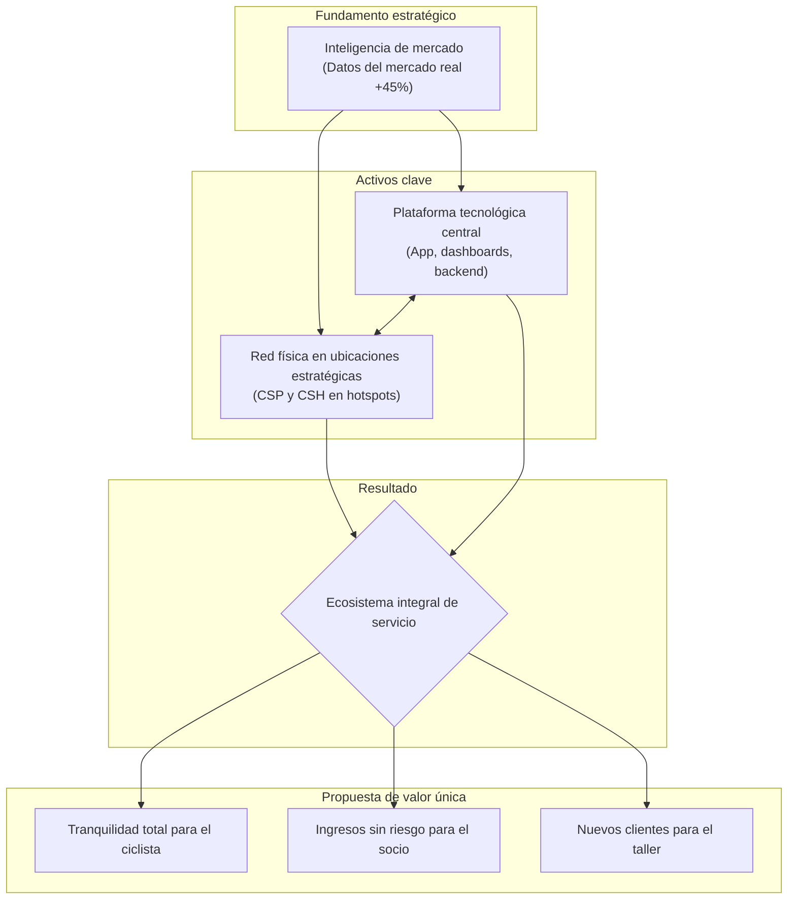

## **3. Propuesta de valor**

La propuesta de valor de Camiño Service Network está diseñada para crear un ecosistema simbiótico donde cada uno de los tres actores clave (el ciclista, el socio que aloja el Service Point y el Taller Oficial) obtiene un beneficio tangible y sustancial.

###  3.1. Propuesta para el ciclista (cliente final)

**Declaración de valor:** "Tu red de asistencia integral en el Camino. Disfruta de tu aventura con la total tranquilidad de saber que tienes la solución precisa para cada imprevisto, desde un ajuste rápido hasta una reparación experta, todo en una sola aplicación."

Nuestra propuesta para el ciclista se resume en una sola palabra: **tranquilidad**. Eliminamos por completo la incertidumbre, el mayor *pain point* del viaje. Esto se materializa a través de una solución dual que ofrece lo mejor de dos mundos. Por un lado, una red densa de **Camiño Service Points** le da la autonomía para realizar auto-reparaciones con herramientas profesionales. Por otro, una red certificada de **Talleres Oficiales Camiño Service** le garantiza el acceso a asistencia experta para averías complejas. No hay problema mecánico que nuestra red no pueda resolver.

###  3.2. Propuesta para el socio Camiño service point (CSP)

**Declaración de valor:** "Conviértete en un punto de referencia indispensable para los ciclistas del Camino. Atrae un flujo constante de clientes de alto valor, medible gracias a nuestros datos del mercado real, y genera ingresos pasivos sin ninguna inversión y con cero carga de trabajo."

Para los socios que alojan nuestros puntos de servicio (albergues, hoteles, casas rurales), el beneficio es claro y directo. Les ofrecemos una **nueva línea de ingresos recurrente y completamente pasiva**, generada a través de un modelo de comisión o alquiler por el espacio cedido. El sistema es autónomo: nosotros instalamos, mantenemos y reponemos todos los módulos a nuestro coste. El socio no tiene que vender, cobrar ni gestionar nada. Además, su establecimiento se convierte en un punto de referencia en la red, atrayendo a un flujo de ciclistas de alto poder adquisitivo que representa una oportunidad de venta cruzada directa y cuantificable para su negocio principal.

###  3.3. Propuesta para el Taller oficial Camiño service (CSH)

**Declaración de valor:** "Conviértete en el taller de referencia del Camino en tu zona. Te conectamos con un mercado de más de 23.000 ciclistas anuales solo en el Camino Francés, digitalizamos tus reservas y simplificamos tus cobros, para que tú te centres en lo que mejor sabes hacer: reparar bicicletas."

Para los talleres mecánicos, nos convertimos en su principal **canal de adquisición a un mercado de alto valor** que, hasta ahora, era en gran medida inaccesible para ellos. A través de nuestra plataforma, les generamos un flujo constante de clientes, permitiéndoles aumentar su facturación y rentabilizar sus horas de menor actividad. Todo ello bajo un modelo de **comisión por éxito (17.5-20%)**: solo pagan por los trabajos que efectivamente les generamos, eliminando cualquier riesgo. Además, modernizamos su negocio con un sistema de reservas online y una pasarela de pagos integrada que optimiza su gestión y les otorga un sello de calidad y prestigio en la ruta.

###  3.4. Ventaja competitiva y diferenciación

Nuestra ventaja competitiva no reside en un único elemento, sino en la **integración sinérgica de toda la propuesta de valor**, creando un ecosistema que es mucho más valioso y defendible que la suma de sus partes.

Nuestra diferenciación se fundamenta en tres pilares clave:

1. **Modelo de ecosistema integral vs. servicio aislado:** somos la única plataforma que ofrece una solución completa y conectada para el 100% de las incidencias, desde el auto-servicio en un Service Point hasta la reparación profesional en un Taller Oficial.
2. **Automatización como ventaja de coste:** nuestro enfoque en la automatización (vending, acceso por QR, gestión digital) nos permite operar con una estructura de costes radicalmente más baja y ofrecer a nuestros socios un modelo de colaboración sin fricción.
3. **Alineación de intereses:** nuestro modelo económico, basado en comisiones y revenue share, está diseñado para que solo tengamos éxito si nuestros socios tienen éxito. Esta alineación total fomenta una colaboración sólida y a largo plazo, creando una barrera relacional muy difícil de superar.
