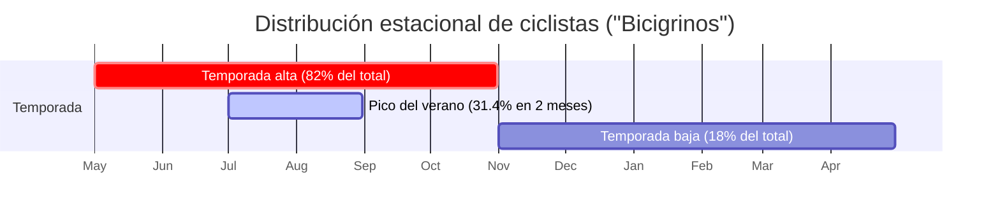

## **2. Análisis de mercado**

###  2.1. Tamaño del mercado y potencial (TAM–SAM–SOM)

Para dimensionar de forma rigurosa la oportunidad, aplicamos el análisis TAM-SAM-SOM, validado con los datos ajustados de nuestro informe metodológico.

- **TAM (total addressable market - mercado total direccionable):** representa el mercado global de servicios y productos para el cicloturismo en las grandes rutas de peregrinación y aventura de Europa, como EuroVelo o la Via Francigena. Se trata de un mercado de miles de millones de euros que valida la escalabilidad a largo plazo de nuestro modelo de negocio.
- **SAM (serviceable addressable market - mercado direccionable servible):** es el mercado real y completo de ciclistas que recorren el Camino de Santiago anualmente. Utilizando nuestras proyecciones ajustadas para 2025, el SAM se sitúa en aproximadamente **37.700 ciclistas**. Este es el "pastel" total al que aspiramos en el mercado español, un mercado un 45% más grande de lo que indican las cifras en las que se basa la competencia.
- **SOM (serviceable obtainable market - mercado objetivo alcanzable):** es nuestro mercado objetivo realista durante la fase inicial de 24 meses. Para maximizar el retorno y validar el modelo en el entorno más denso posible, nos enfocaremos en el **Camino Francés**. Esta ruta, según datos históricos consistentes, concentra el **62,6%** del flujo de ciclistas.
  - **Cálculo del SOM:** 37.700 ciclistas (SAM 2025) × 62,6% = **~23.600 ciclistas anuales**.
  - Este es nuestro campo de juego inicial. Un mercado lo suficientemente grande y concentrado para probar, consolidar y rentabilizar nuestro modelo de negocio antes de iniciar la expansión a otras rutas.

###  2.2. Segmentación y _buyer personas_

Para diseñar una propuesta de valor precisa y efectiva, hemos segmentado el mercado y creado dos "buyer persona" que representan a nuestros clientes ideales.

**Segmentación Conductual**

1. **"Javier, el aventurero planificador" (Ciclista ocasional / turista - 60% del mercado)**
   - **Perfil:** tiene 48 años, es ingeniero y realiza el Camino en pareja. Utilizan bicicletas de montaña de gama media-alta. Aunque es una persona organizada, sus conocimientos de mecánica son básicos. Para él, el Camino es una experiencia de disfrute, no una prueba de supervivencia.
   - **Objetivos:** su meta es disfrutar del paisaje, la gastronomía y la experiencia, completando la ruta planificada sin estrés ni interrupciones imprevistas.
   - **Frustraciones:** su mayor miedo es la incertidumbre. Como él mismo dice: "Odio la incertidumbre. Me estresa pensar que una avería simple como una rotura de cadena pueda arruinarme un día entero buscando un taller abierto".
   - **Necesidades:** Javier busca soluciones "llave en mano". Valora la seguridad y está dispuesto a pagar por un servicio que le garantice acceso a asistencia profesional. Es el usuario principal de nuestra red de **Talleres Oficiales Camiño Service (CSH)**.

2. **"Anne, la ciclista internacional" (Ciclista experimentado / aficionado - 40% del mercado)**
   - **Perfil:** tiene 35 años, es diseñadora gráfica de Alemania y viaja sola con equipaje ligero (_bikepacking_). Es una ciclista experimentada y autosuficiente en mecánica básica, pero su filosofía de viaje le impide cargar con herramientas pesadas o muy específicas.
   - **Objetivos:** su motivación es superar un reto personal, viajar de la forma más ligera posible y mantener su independencia en todo momento.
   - **Frustraciones:** su principal limitación son las herramientas. Lo expresa así: "No puedo cargar con todas las herramientas. Me falta una bomba de alta presión para talonar mi cubierta _tubeless_ o un soporte para trabajar cómodamente en la bici".
   - **Necesidades:** Anne no necesita que le reparen la bicicleta, sino acceso a las herramientas adecuadas para hacerlo ella misma. Valora la autonomía y el acceso a material de calidad. Es la usuaria principal de nuestros **Camiño Service Points (CSP)**.

###  2.3. Estacionalidad y patrones de demanda

La demanda en el Camino de Santiago es marcadamente estacional, un factor crítico que debe ser gestionado con precisión a nivel operativo y financiero. Los datos confirman un patrón muy claro.

Las implicaciones operativas de esta distribución son directas:

- **Temporada alta (mayo - octubre):** este periodo concentra el **82% de la actividad anual**. Requiere una logística de reposición de stock ágil (con SLAs inferiores a 72 horas), una plataforma tecnológica de alta disponibilidad y un soporte a partners y talleres inmediato. La generación de caja es máxima.
- **Temporada baja (noviembre - abril):** el flujo de caja se reduce drásticamente. El foco del equipo central se desplaza hacia el mantenimiento de los kits, el desarrollo de nuevas funcionalidades, el análisis de datos para la optimización y la planificación estratégica de la siguiente temporada. Es crucial haber generado un colchón financiero durante los meses de alta actividad para cubrir los costes fijos de este periodo.

###  2.4. Análisis competitivo y posicionamiento

Nuestra estrategia competitiva no se basa en la confrontación directa, sino en un modelo de **integración y superación del ecosistema de servicios actual**. No llegamos para reemplazar a los actores existentes, sino para organizarlos, potenciarlos y cubrir los vacíos que dejan, creando una red de valor superior donde todos los participantes ganan.

| Alternativa actual                      | Fortalezas                                           | Debilidades (nuestra oportunidad)                                                                                                    | Nuestro posicionamiento y solución                                                                                                                                                                                                   |
| :-------------------------------------- | :--------------------------------------------------- | :----------------------------------------------------------------------------------------------------------------------------------- | :----------------------------------------------------------------------------------------------------------------------------------------------------------------------------------------------------------------------------------- |
| **Talleres mecánicos independientes**   | Experiencia técnica y confianza del cliente local.   | Fragmentación, horarios rígidos, stock no especializado y nula visibilidad digital para el peregrino.                                | **Somos su canal de adquisición (modelo CSH):** no competimos. Nos convertimos en su principal fuente de clientes peregrinos, digitalizando sus reservas y pagos a cambio de una comisión. Les llevamos negocio, no se lo quitamos.  |
| **Albergues / tiendas con "servicios"** | Ubicación estratégica directa en la ruta.            | Baja calidad e inconsistencia. Ofrecen soluciones improvisadas sin un modelo de negocio claro, generando una experiencia frustrante. | **Somos la profesionalización (modelo CSP/CSS):** reemplazamos su oferta deficiente con nuestros Service Points profesionales y autónomos, garantizando un estándar de calidad y generando para ellos una fuente de ingresos pasiva. |
| **Auto-reparación (DIY)**               | Autonomía y conocimiento del ciclista experimentado. | Limitación de recursos. El ciclista no puede transportar herramientas pesadas ni todos los repuestos posibles.                       | **Somos su taller extendido:** nuestros Service Points le proporcionan el utillaje profesional y los repuestos que no puede llevar consigo, potenciando su autonomía en lugar de anularla.                                           |

**Posicionamiento estratégico:** Camiño Service Network se posiciona como **la plataforma de asistencia de referencia para el ciclista en el Camino de Santiago.** Ofrecemos una experiencia predecible, estandarizada y de alta calidad que ninguna de las alternativas actuales puede igualar por sí sola. Somos la garantía de que cualquier imprevisto mecánico tiene una solución fiable a un solo clic de distancia.

###  2.5. Barreras de entrada

Un modelo de negocio exitoso debe ser defendible a largo plazo. Nuestras barreras de entrada (o "fosos competitivos") se construyen de forma progresiva y se refuerzan mutuamente.

Nuestra primera y más potente barrera es la **ventaja informacional**. Al basar nuestro despliegue en el mercado real, y no en las cifras oficiales, podemos asegurar los acuerdos con los partners más valiosos en los "hotspots" de mayor flujo de ciclistas antes de que la competencia siquiera reconozca su verdadero potencial.

A partir de ahí, construimos las siguientes defensas:

- **Efecto de red (barrera principal):** es nuestra mayor defensa. Cuantos más ciclistas usan la plataforma, más atractiva es para partners y talleres. Cuantos más partners y talleres se unen, más útil es para el ciclista. Este ciclo virtuoso es muy difícil de replicar para un nuevo competidor desde cero.
- **Acuerdos de colaboración:** al firmar con los mejores locales en cada tramo, ocupamos los "activos" más valiosos de la ruta. Un competidor se encontraría con que los puntos estratégicos ya están integrados en nuestra red.
- **Tecnología propietaria:** la plataforma (app, dashboards y backend logístico) es un activo desarrollado a medida. Su funcionalidad y los datos que recopila constituyen una ventaja operativa y estratégica difícil de igualar.
- **Marca y confianza:** a medida que operemos, construiremos una marca asociada a la fiabilidad y la seguridad en el Camino. La confianza es un activo intangible pero muy poderoso que un nuevo actor tardaría años en construir.
